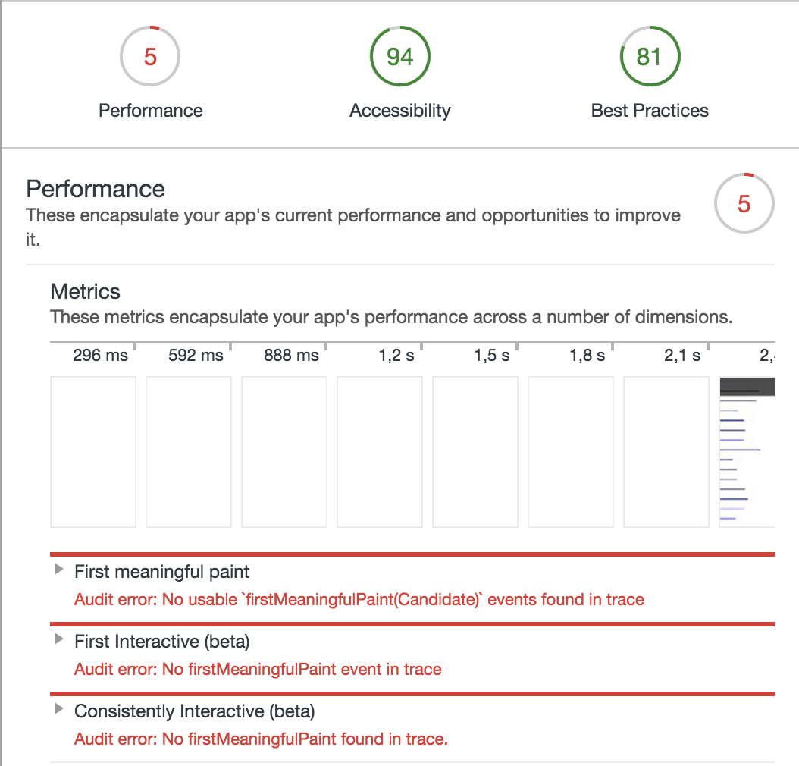
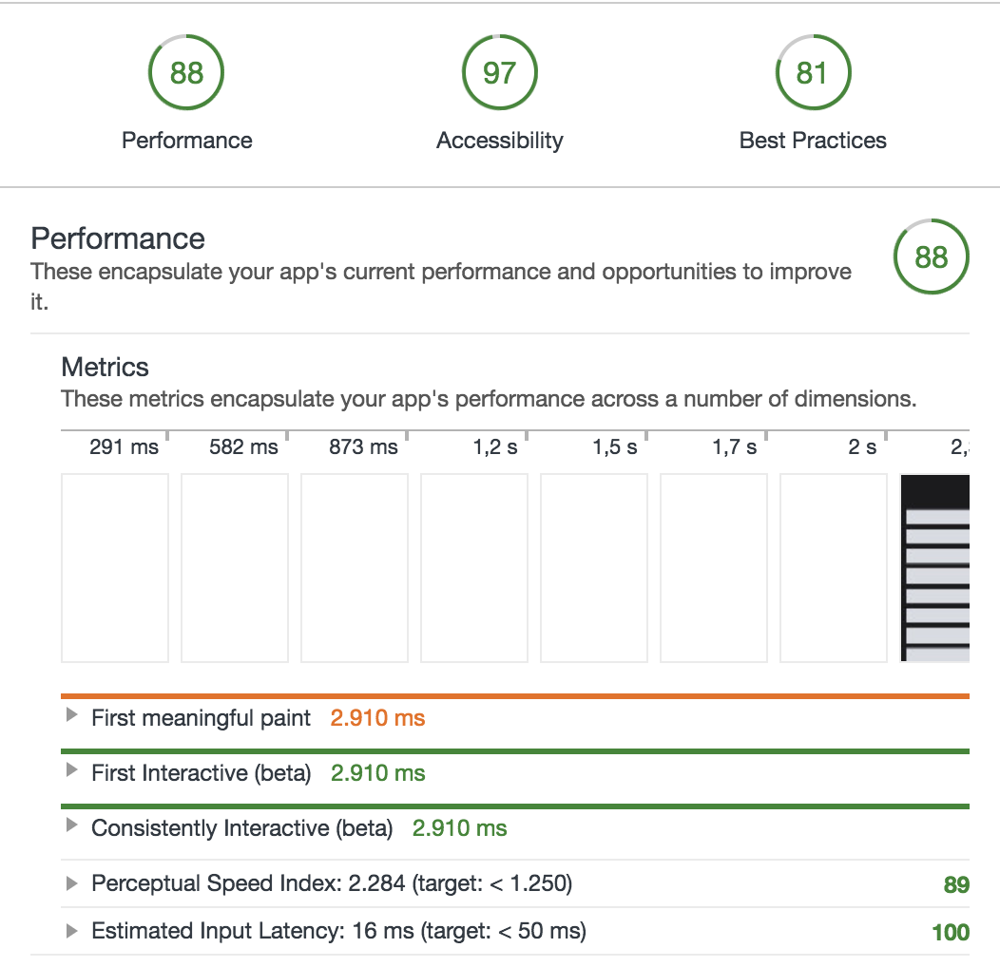

# Audit

These are the audits I made for my OBA application. The status written under network tab are the averages and may be off a few ms with each load.

## Tools
The main tool I used for the audits is Google Chrome Devtools with these tools:

- Network (Disable cache & Throttle 3G)
- Timeline
- Audits

## First snapshot

The first snapshot is made after bundling all of the clientside `JS` with `Browserify`.

### Optimized build with minification, bundling and compression:

Conclusion At last there seems to be a increase in the first and consitently interactive state. The first meaningfull paint did improve a lot. Because of the injected CSS there is a increase of KB transferred but also a decrease in the first meaninfull paint.
