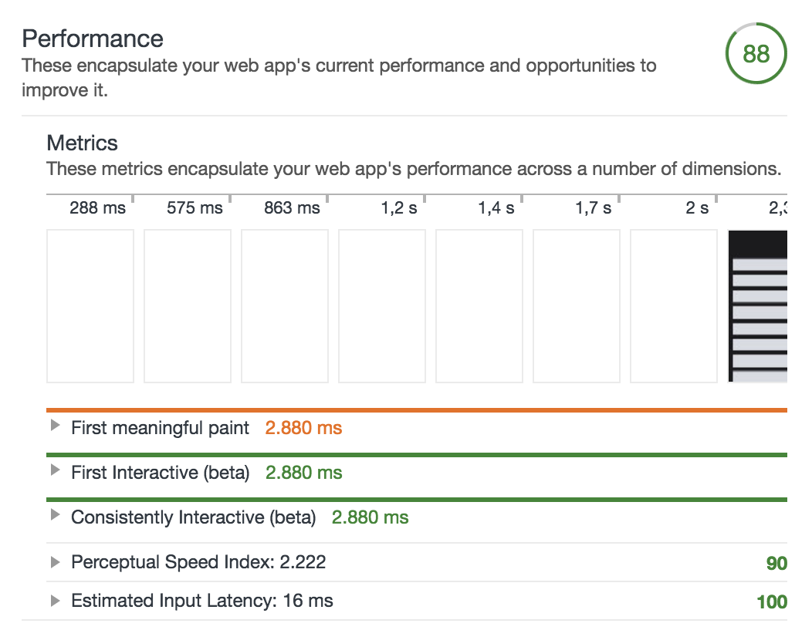
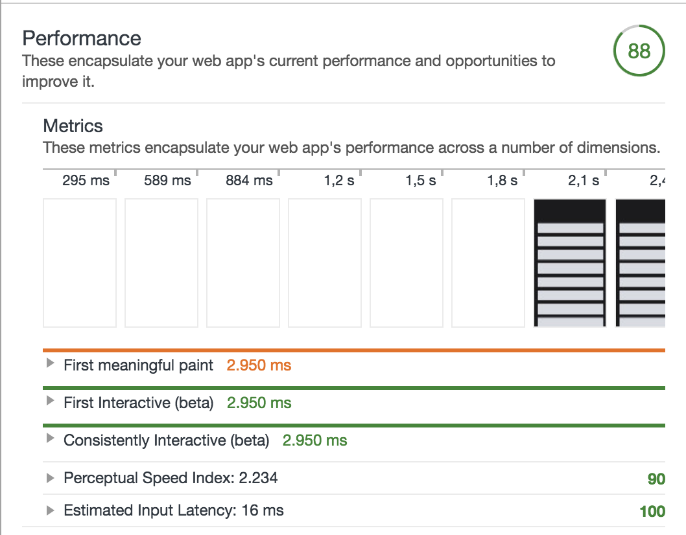
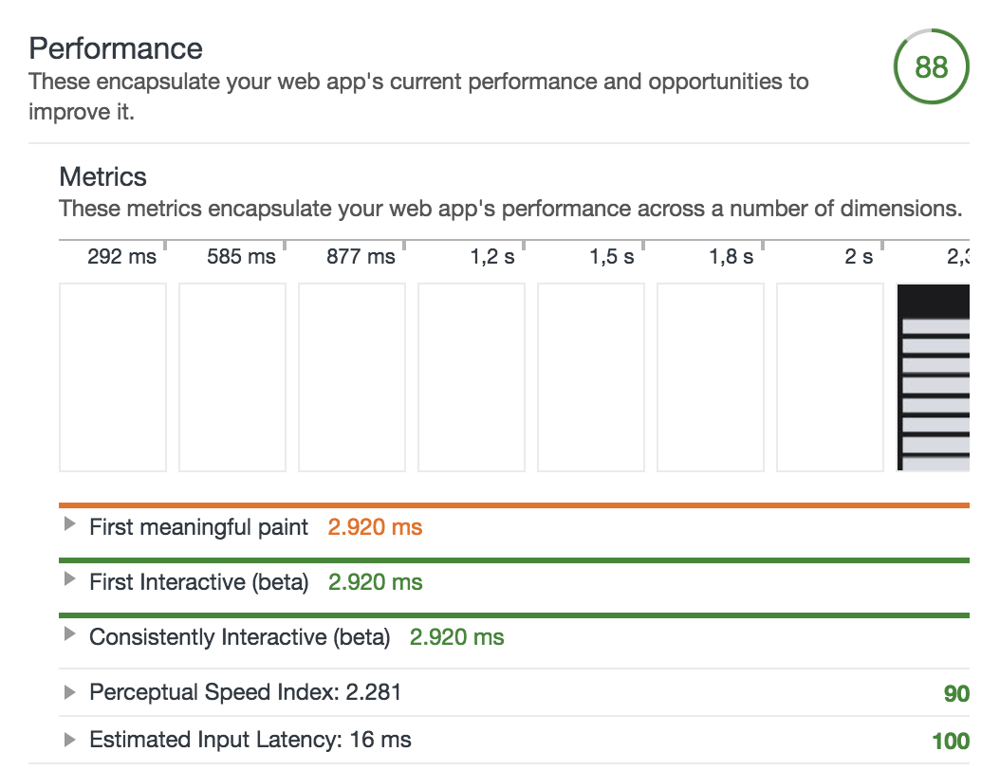
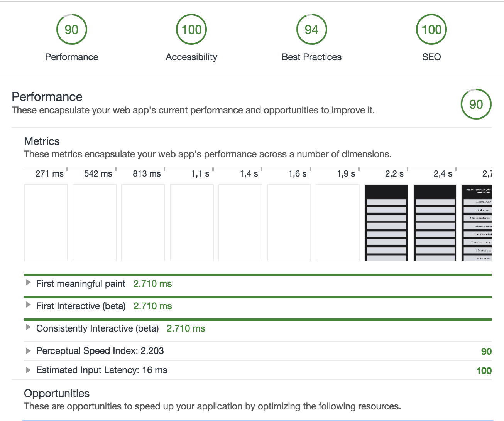

# Audit

These are the audits I made for my OBA application.

## Tools
The main tool I used for the audits is Google Chrome Devtools with these tools:

- Network (Disable cache & Throttle 3G)
- Timeline
- Audits

## Optimalisations

- Bundling clientside Javascript and minifying it with `uglify-js`.
- Minify css with `postCSS`.
- Using the `compression` package in Node.js.
- Added `service worker` to serve static files.

## First snapshot

The first snapshot without any minification or compression.

These are the Performance opportunities Google Chrome audit gives me:
- Reduce render-blocking stylesheets
- Enable text compression
- Minify javascript
- Remove unused CSS rules
- Minify CSS

## Minified and bundled JS
The second snapshot is made after bundling all of the clientside `JS` with `Browserify` and minifing it with `uglify-js`.

A little improvement in the `First meaningfull paint` and `interactive state` of 100ms, also the perceptual speed index score from `89` to `90`.

## Minified CSS
The third snapshot is made after minifing all of CSS with `postCSS`.

A little improvement in the `First meaningfull paint` and `interactive state`.

## Using compression in Node.js
The fourth snapshot is made after enabling the compression package in Node.js.

Small overal improvement but not very much.

## Added service worker
The fifth and latest snapshot is made after adding a service worker to serve static files.

An improvement in the `First meaningfull paint` and `interactive state`.

## Conclusion
There seems to be a increase in the first consitently and interactive state. The first meaningfull paint did also improve a little. The performance score increased from `88` to `90`.

## Extra improvements

More things that can increase the performance is:
- Reduce render-blocking stylesheets
- Remove unused CSS
